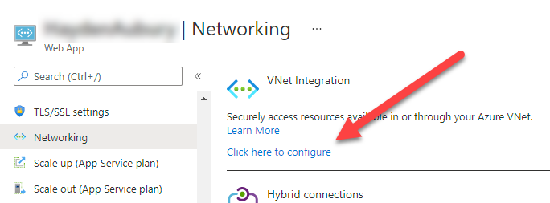

TL;DR; You can set up Azure App Services so they can only be accessed from an internal vNet. But you can do it in different ways and they come with different tradeoffs. For now, you are *probably* better off with Service End Points rather than Private End Points.

# A couple of concepts
Before we get into the specifics, it's worth explaining a couple of important concepts.

## Connecting to the vNet
vNets in Azure are traditionally more geared towards the Infrastructure-as-a-Service (IaaS) rather than Platform-as-a-Service (PaaS). Support for PaaS has been slowly growing over the last several years, going through several iterationsm, which is why we now have more than one way of doing the same thing.

When you connect, say, a VM to a vNet it behaves in a way that makes intuitive sense - the VM is "on" that vNet; all it's inbound and outbound traffic goes through that vNet. It is possible to also give such a VM a public IP address, which is similar to a "multi homed" machine in traditional terms.

When you connect a PaaS service to a vNet, it doesn't work like that - the PaaS service lives outside the vNet but there are different ways you can allow traffic to and from the PaaS service from the vNet.

For an App Service, you can allow the App Service to talk *to* resources on the vNet, such as VMs or other PaaS services like Azure SQL which are themselves connected to the vNet. You do this in the Networking - vNet Integration option. 

This does not allow anything on the vNet to talk *to* the App Service. When you need something on the vNet to talk *to* the App Service - usually where the App Service is some kind of internal service - then you need a Service Endpoint or a Private Endpoint. These behave differently and have different trade-offs as detailed below.

# Service Endpoints
Service Endpoints is the older way to connect to PaaS services from a vNet. They are pretty magical. Let's say you have a VM sitting in subnet "vms". You have to allow "Service Endpoint connections" *from* that subnet to App Services *and* you need to configure the specific App Service to accept connections *from* that subnet.   
Similarly, you can allow App Service "A" to talk *to* the vNet via a subnet - let's call it "frontend" - and you can then configure App Service "B" to accept connections *from* the "frontend" subnet.

What is interesting is that App Service B will *not* get a private IP address on the vNet. The connection from A to B is to B's *public* IP address, but some magical internal routing makes this possible. 

The main drawbacks are;
- App Service B is not "on" the vNet so you have to explicitly allow access from each subnet that needs it.
- VPN???
- Multi region may be a problem
- You can deploy to the App Service directly from Azure DevOps. You need to give the "CloudApps" service tag access to SCM site (not the main site). Note that this will give all Virtual Machines deployed in Azure access to the SCM site so from a pure network point of view, it is only marginally better than giving public access to the SCM site. The SCM site is, of course, still protected by Azure AD.

# Private Endpoint scenario
Private Endpoints are the more recent way of doing it and, generally speaking, the better way. With a Private Endpoint, your PaaS service will get an actual private IP address and a NIC on the vNet. This is still only for inbound traffic, but it means things like routing and DNS works in ways you can reason about.

However, for App Services in particular, there are some major drawbacks.
- You must have a Premium App Service Plan.
- As soon as you create a Private Endpoint on an App Service, all public access is blocked and you cannot override it. It is no longer possible to use IP restrictions or Service Tags to allow traffic through any route other than the Private Endpoint. This means it is not possible to deploy directly from Azure DevOps. You need to install build agents inside your vNet to do the deploy(**LINK**)
- You can connect to Private Endpoints through an Azure VPN. At the time of writing, the VPN client does not correctly use the automatic DNS service so you need to deploy a DNS forwarder on a VM in your vNet for that to work. (**LINK**)