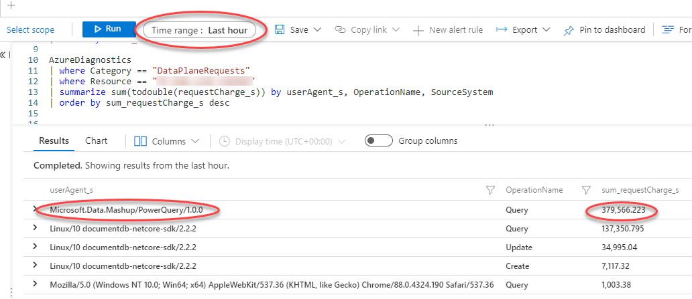

TL;DR; You can log all the request to Azure CosmosDB to Log Analytics so you can analyse where the requests are coming from.

**Background**: One of the systems we build and run on Azure for one of our clients, we had a problem when deploying a new version. As soon as the new version was deployed, performance would fall to unusable levels. We could not reproduce this in any test environments, it only happened in live. We figured out that the problem was most likely caused by the CosmosDB running at capacity and something in the new release just added a tiny bit of extra load that tipped it over the edge. We could see in Azure that the CosmosDB was running at 80%-100% utilisation, though with a very low level of throttling.

The application uses Application Insights, so we used that to [look for excessive use from the application](https://www.lytzen.name/2019/05/20/find-select-nplus1-with-app-insights.html) - but there was nothing out of the ordinary.

Application Insights is built on top of Log Analytics and uses the same engine for log ingestion. They both share the same, very powerful, query language that can be used to quickly analyse and visualise large log volumes. Application Insights is primarily about applications, but many more things can log directly to Log Analytics - including CosmosDB and Azure SQL.

# Switching on Diagnostics
We created a new Log Analytics workspace and then told CosmosDB to log all requests to that workspace:

# Analysing the data
After waiting an hour to get some data to work with, we wrote a few queries:

## Who is sending most requests?

We can see that Power BI is responsible for about 11% of the requests. Not too bad, but still quite high.

## Who is using the most Request Units?

Wow, so PowerBI is using ~70% of the total capacity on CosmosDB. That is definitely a problem.

## How often is PowerBI making requests?

The client told us that they have a number of PowerBI reports that auto refresh - but they are not supposed to refresh very often. Despite that, we can see that PowerBI makes more than 250 requests per minute so something is amiss.

# Conclusion
In this case, we concluded that some of the client's PowerBI reports were poorly written, meaning they downloaded vast amounts of data and did the filtering on the client side. 
CosmosDB has a limit on how many documents you can receive per request, so when PowerBI nominally does a single call to get a large amount of data, it will cause a large number of sequential calls to the database to get all the data. This also fits the pattern we saw where the database was under high load, but with little throttling.

Incidentally, it is very easy to write PowerBI reports that kill the database. It is essential to hand-craft a SELECT statement to limit the data both vertically and horizontally before it is pulled into the visual designer.

